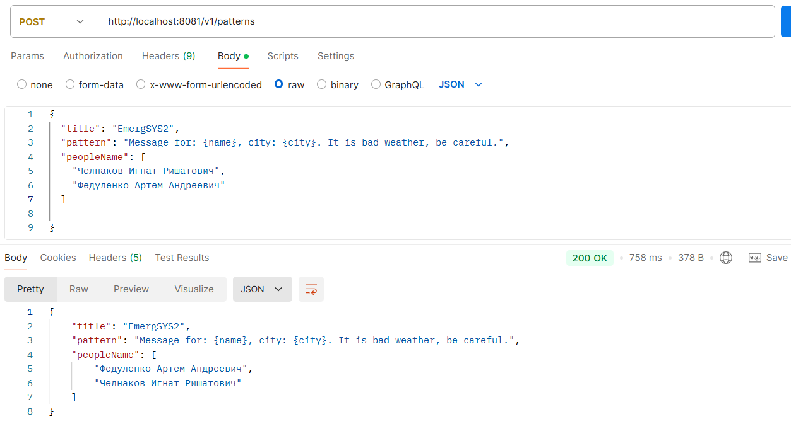

### Описание:
Сервис для отправки пользователям нотификации о чрезвычайных ситуациях.
### Основные фичи:
- **Общение микросевисов при помощи брокера сообщений (_Kafka_)** - приложение поделено на два основных микросервиса - клиент для загрузки шаблонов нотификаций и пользователей и сервис для отправки нотификаций. Клиент отправляет в брокер информацию об нотификциях, которые необходимо отправить, а сервис отправки нотификаций получает эту информцию из брокера и обрабатывает ее. Такой подход имеет ряд преимуществ:
  - асинхронная работа сервисов
  - надежность системы
- **Кэширование данных о пользователях и шаблонах (_Redis_)** - такой прием позволяет быстро доставать самые частозапрашиваемые данные, что увеличивает быстродействие системы. Также, присутсвует настройка TTL.
- **Использование API для отправки SMS и писем (_GatewayAPI, Google SMTP_)**
- **Использование библиотек для парсинга CSV и XLS/XLSX файлов (_Commons CSV, Apache POI_)** - приложение предоставляет возможность загружать пользователей в на сервер используя таблицы, где можно указать все необходимые данные
- **Повторная асинхронная проверка базы данных для подтверждение того, что данные точно отпарвились (_База данных - PostgreSQL_)** - для реализации функционала пришлось вводить систему статусов для каждой нотификации с последующим их изменением.
### Технологии и инструменты:
- **Java** — основной язык программирования
- **Spring Boot** — фреймворк
- **Maven** — инструмент для сборки проекта
- **PostgreSQL (в связке с Spring Data)** — база данных
- **Kafka** — брокер сообщений
- **Google SMTP, GatewayAPI** — API для отправки нотификаций
- **Commons CSV, Apache POI** — библиотеки для парсинга табличных файлов
- **Redis** — кэширование данных
- **Docker Compose** — развёртывание внешних сервисов

### Тестирование:
- **Postman** — для тестирования API

### Демонстрация:
- загрузка пользователей при помощи xls файла:

- загрузка пользователей при помощи csv файла:

- добавление шаблона нотификации:

- добавление людей пользователей к уже созданному шаблону:

- получение всех пользователей (с пагинацией):

- отправка нотификации на email:

за отпрвку на sms нужно платить денежку :(